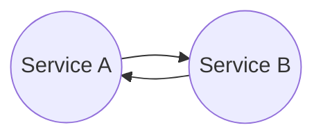
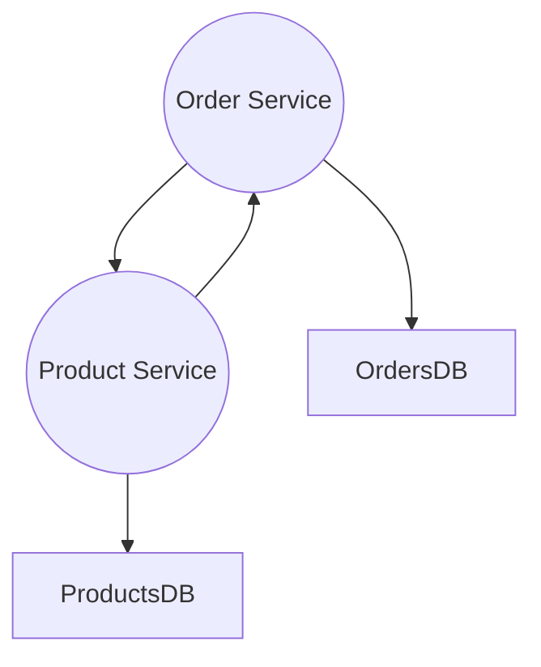

# Order Products Exercise

[TOC]

## Introduction

So, you are learning **Java with Spring Boot** and you want to test the things you have learned, this exercise maybe can help you test that knowledge and see what comes next or what things you can improve.

The idea is very simple, **2 Spring Boot Services** that communicate with each other.

## Objetive

How I said the objective is put in practice the things that you have learned and thing what's next, what things you can improve.

## Use Case

The idea is quite simple you need to develop two services and communicate with each other.

For this example, imagine an online store application that needs to manage orders and products, your task is to develop these necessary services for the application.

These services will be communicate through **REST**, **Service A** will be your **Order Service** and **Service B** will be your **Product Service** each service will have its **own data base.** 

### Order Service

This service will create, read, update and delete  purchase orders (**CRUD**).

To create a order you must verify that the quantity of product requested can be provided, if the quantity of product cannot be provided then the **order status** will be **Out Stock**, if the quantity of products can be provided then the **order status** will be **Active.**

Once the order is created you can change the quantity of products or the **customer information** (**Email, Phone**), each time that the order information change we need to update the **order status** to **Modified** and set the **last update date**, do not forget always check if you can provide the new number of products requested.

Once the order is delivered to the customer we can **complete**, update the orderer status and the **last update date.**

Also we can cancel orders, if an order is **canceled** we need update the order status and the **last update**.

We need to query the information that we are stored. We need to get **all the orders, orders canceled, orders by email, orders with "out stock" status.**

### Product Service

The idea is the same that the Order Service, develop a **CRUD**

We need to create products with a initial number of products in the stock, when a product is created the **product status** will be **available**, we cannot add products with a quantity equals to zero.

We can update the quantity of products available for each product, when we increase the number for a supply or decrease the number of products available for a new order we need set the **last update date**, if the quantity of products is equals to zero the **product status** will be **out stock** do not forget update the **last update**.

Also remember when an order is canceled we need to return that quantity of products or if a order change and the quantity of products decrease.

We want to get the following information, we want to get **all the products, products by name ,products that are close to out stock**, for that we have a rule of less than 3 products is a product that is close out of stock.

## Requirements

* Use Java 8 lambdas

* Use a relational database and a no sql data base

* Use all the HTTP methods

* Use Spring Data dynamic queries, custom queries and the default methods provided by crud repository.

* Implements a error handling

* Use a multi module maven project

* Use **ENUM** for the status

  

### Notes

* You define the models and the necessary properties.
* You define which service use **no sql** and with one use **sql**

